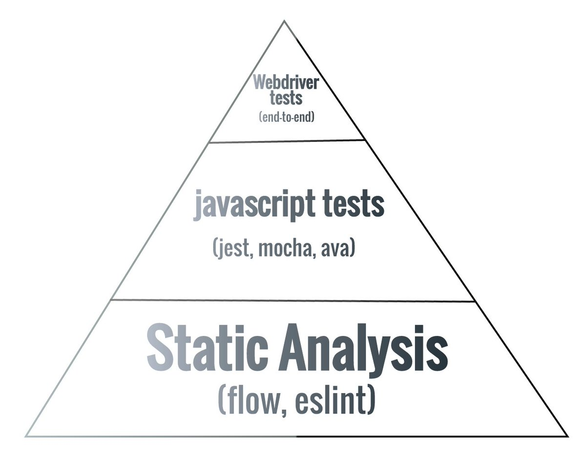

theme: Next, 3

# Effective Flow Typing
### Bring safety back to your refactors

---

## :point_right: Why flow?
## :point_right: Where does flow fit?
## :point_right: How to best leverage it

---

## Where flow fits



^ Re: tests,  All that matters is (how much value, how long does it take to write, & how long does it take to run?) Categories not helpful

---
[.build-lists: true]

## Why flow?
- True 100% coverage
- Built in (and validated) docs
- Catches incorrect assumptions
- Refactor with confidence

^ I want to start w/ some short reasons why flow is important

  really hard to get get a runtime exception w/ a properly flow-typed code base.
  Also a good rule of thumb: if it's hard to typecheck, it's probably hard to understand
  credit on the first 3 slides go to Forbes Lindesay's talk from React Amsterdam => https://youtu.be/lk8o7ym29WM

---
# Enabling flow

## `// @flow`

^ Flow can be enabled in any file by simply adding `// @flow` to the top of the file

---

## Escape hatches
[.build-lists: true]

- `any`/`Function`/`Object`
- `// $FlowFixMe`

^ Flow gives us 2 escape hatches to enable us to retain the speed & simplicity of JS when prototyping ideas
  - `any`/`Function`/`Object`
    + Has little to no validation, but can allow you to work quickly before refining your data flow
    + **Can lead to runtime exceptions**
    + Should be avoided as much as possible, can largely be solved with aliases, unions & intersections, and interfaces
  - `// $FlowFixMe`
    + Disables flow typing on the next line
    + Useful when there might be an error with flow itself, or you just can't make the type system understand what you're trying to do
    + Should be used sparingly, if at all

---

## Primitives - Literals

Types for literal values are lowercase

```javascript, [.highlight: 2-4]
function method(
  x: number,
  y: string,
  z: boolean,
) {
  // ...
}
method(3.14, "hello", true);
```

---

## Primitives - Constructed objects


Types for wrapper objects are capitalized, the same as their constructor

```javascript, [.highlight: 2-4]
function method(
  x: Number,
  y: String,
  z: Boolean,
) {
  // ...
}
method(new Number(42), new String("world"), new Boolean(false));
```

^ Try to avoid using the constructor objects, whenever possible

---

## The `mixed` type
> "Hey flow, I don't know what this will be, but I promise I won't depend on it's type"
-- Forbes Lindesay

```javascript
type ClickHandler = (e: Event) => mixed
const MyButton = (onClick: ClickHandler) => /*...*/
```

^ [`mixed`](https://flow.org/en/docs/types/mixed/) is similar to `any`, but is not an escape hatch. `mixed` says to flow, "Hey I don't know what this will be, but I promise I won't depend on it's type"

---

# Maybe types

---

## Liberal use of type aliases

---

## Nominal vs. structural

---

## Read-only arrays

```javascript, [.highlight: 2]
function logNullable(
  arr: $ReadOnlyArray<?string>,
) {
  arr.forEach(val => { console.log(val) })
}

const myArr: Array<string> = ['Hello']

logNullable(myArr)
```

^ Using read-only arrays in places where you're not mutating
  will make the errors you get from flow match your expectations more closely

---

## Read-only properties

```javascript, [.highlight: 2]
function logNullable(
  container: { +value: ?string },
) {
  console.log(container.value)
}
const obj: { value: string } = { value: 'Ahoy' }
logNullable()
```

^ Using read-only properties in places where you're not mutating
  will make the errors you get from flow match your expectations more closely

---

## Avoid `any`/`Object`/`Function` as much as possible

---

# It’s **that** easy!

